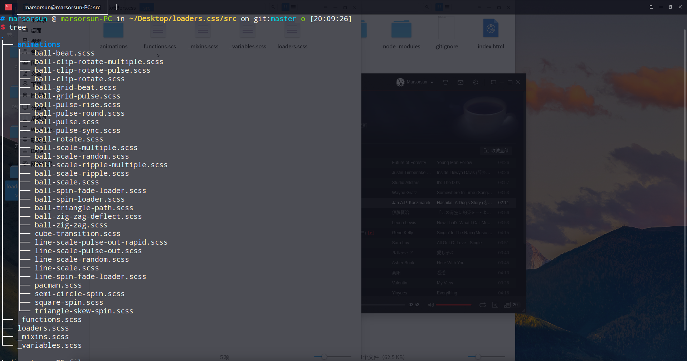

# [loaders.css](https://github.com/ConnorAtherton/loaders.css) 源码解读

`loader.css` 有许多的加载动态效果，我打算解读一下来深入对 `CSS` 的了解

[样式预览](https://unbrain.github.io/loaders-css/index.html)

看该项目的 `src/` 下面的资源可以看到是使用 `scss` 写的，有 29 种加载动画，分为三大类，`Dots`，  `Lines` 以及 `Misc`。把该项目的源码看一遍，可以熟悉使用 `scss` 以及 `@keyframes`，`animation`, `transfrom` 等属性。

---

## 起航

`scss` 来源于 `ruby` 社区的 `sass` 但与 `sass` 关系并不大，它仅仅是有了些简单的方法来帮助人们快速地编写 `css`。

[SASS用法指南](http://www.ruanyifeng.com/blog/2012/06/sass.html)

[SCSS 与 Sass 异同](http://sass.bootcss.com/docs/scss-for-sass-users/)

[node-sass](https://github.com/sass/node-sass)

[好吧，CSS3 3D transform变换，不过如此！](http://www.zhangxinxu.com/wordpress/2012/09/css3-3d-transform-perspective-animate-transition/)

注意写 scss 多成嵌套的时候不要太多，不然就像回调地狱一样让人摸不到头

## scss 结构 


### _functions.scss 

定义了一个 delay 的函数 
### loaders.scss
定义一些全局变量
### _mixins.scss
全局变量的值
可以修改这些值来定制自己喜欢的样式
### _variables.scss

主文件,按啥样的顺序来加载 animation 文件中的样式

## 29 种 loader 效果

纯 css 实现的 loader，真的是让我敬佩项目实现人的想象力了

我用 `：n` 代表该样式里面需要 n 个 `div`

### ball-pulse

- 一个球缩小放大加载效果
- infinite 无限循环
- animation-fill-mode  这个 CSS 属性用来指定在动画执行之前和之后如何给动画的目标应用样式。其实我把它注释后没变化。
- cubic-bezier 又称三次贝塞尔，主要是为 animation 生成速度曲线的函数 

---

#### 知识点：

1. [transform](https://developer.mozilla.org/zh-CN/docs/Web/CSS/transform)
2. [animation](https://developer.mozilla.org/zh-CN/docs/Web/CSS/animation)
3. [:nth-child()](https://developer.mozilla.org/zh-CN/docs/Web/CSS/:nth-child)
4. [animation-fill-mode](https://developer.mozilla.org/zh-CN/docs/Web/CSS/animation-fill-mode)

```scss
@import '../variables';
@import '../mixins';
@import '../functions';
@keyframes scale {
  0% {
    transform: scale(1);
    opacity: 1;
  }
  45% {
    transform: scale(0.1);
    opacity: 0.7;
  }
  80% {
    transform: scale(1);
    opacity: 1;
  }
}
// mixins should be separated out
@mixin ball-pulse($n: 3, $start: 1) {
  @for $i from $start through $n {
    > div:nth-child(#{$i}) {
      animation: scale 0.75s delay(0.12s, $n, $i) infinite cubic-bezier(.2,.68,.18,1.08);
    }
  }
}

.ball-pulse {
  @include ball-pulse();

  > div {
    @include balls();
    @include global-animation();
    display: inline-block;
  }
}
```

---

### ball-grid-pulse

- 大小从 1 -> 0.5 -> 1,透明度 1 -> 0.7 -> 1

- both: 向前和向后填充模式都被应用

```scss
@import '../variables';
@import '../mixins';

@keyframes ball-grid-pulse {
  0% {transform: scale(1);}
  50% {transform: scale(0.5);opacity: 0.7;}
  100% {transform: scale(1);opacity: 1;}}

@mixin ball-grid-pulse($n:9) {
  @for $i from 1 through $n {
    > div:nth-child(#{$i}) {
      animation-delay: ((random(100) / 100) - 0.2) + s;
      animation-duration: ((random(100) / 100) + 0.6) + s;
    }
  }
}

.ball-grid-pulse {
  @include ball-grid-pulse();
  width: ($ball-size * 3) + $margin * 6;
  > div {
    @include balls();
    @include global-animation();
    display: inline-block;
    float: left;
    animation-name: ball-grid-pulse;
    animation-iteration-count: infinite;
    animation-delay: 0;
  }
}
```

---

### ball-clip-rotate

- 旋转 360

- 现实上其实大小也变了，主要是 `rotate` 在这个项目多次出现，最后的 `rotate`  为

  ```css
  0% {transform: rotate(0deg) scale(1);}
  50% {transform: rotate(180deg) scale(0.6);}
  100% {transform: rotate(360deg) scale(1);}
  ```

- liner 线性渐变

- infinite 规定动画应该无限次播放

```scss
@import '../variables';
@import '../mixins';

@keyframes rotate {
  0% {transform: rotate(0deg);}
  50% {transform: rotate(180deg);}
  100% { transform: rotate(360deg);}}

.ball-clip-rotate {
  > div {
    @include balls();
    @include global-animation();
    border: 2px solid $primary-color;
    border-bottom-color: transparent;
    height: 26px;
    width: 26px;
    background: transparent !important;
    display: inline-block;
    animation: rotate 0.75s 0s linear infinite;
  }
}
```

---

### ball-clip-rotate-pulse：2

- 大圆包小圆
- 利用透明色
- 利用上下 border

只细看作者还是写了些没必要的代码，嘎嘎嘎

```scss
@import '../variables';
@import '../mixins';

@keyframes rotate {
  0% {transform: rotate(0deg) scale(1);}
  50% {transform: rotate(180deg) scale(0.6);}
  100% {transform: rotate(360deg) scale(1);}}
@keyframes scale {
  30% {transform: scale(0.3);}
  100% {transform: scale(1);}}

.ball-clip-rotate-pulse {
  position: relative;
  transform: translateY(-15px);

  > div {
    @include global-animation();
    position: absolute;
    top: 0px;
    left: 0px;
    border-radius: 100%;
    &:first-child {
      background: $primary-color;
      height: 16px;
      width: 16px;
      top: 7px;
      left: -7px;
      animation: scale 1s 0s cubic-bezier(.09,.57,.49,.9) infinite;}

    &:last-child {
      position: absolute;
      border: 2px solid $primary-color;
      width: 30px;
      height: 30px;  
      left: -16px;
      top: -2px;
      background: transparent;
      border: 2px solid;
      border-color: $primary-color transparent $primary-color transparent;
      animation: rotate 1s 0s cubic-bezier(.09,.57,.49,.9) infinite;
      animation-duration: 1s;
    }
  }
}
```

---

## 'square-spin': 1

- [perspective()](https://developer.mozilla.org/zh-CN/docs/Web/CSS/perspective)在这时用主要在旋转时产生 3d 效果

```scss
@import '../variables';
@import '../mixins';

@keyframes square-spin {
  25% {
    transform: perspective(100px) rotateX(180deg) rotateY(0);
  }
  50% {
    transform: perspective(100px) rotateX(180deg) rotateY(180deg);
  }
  75% {
    transform: perspective(100px) rotateX(0) rotateY(180deg);
  }
  100% {
    transform: perspective(100px) rotateX(0) rotateY(0);
  }
}

.square-spin {
  > div {
    @include global-animation();
    width: 50px;
    height: 50px;
    background: $primary-color;
    animation: square-spin 3s 0s cubic-bezier(.09,.57,.49,.9) infinite;
  }
}
```

